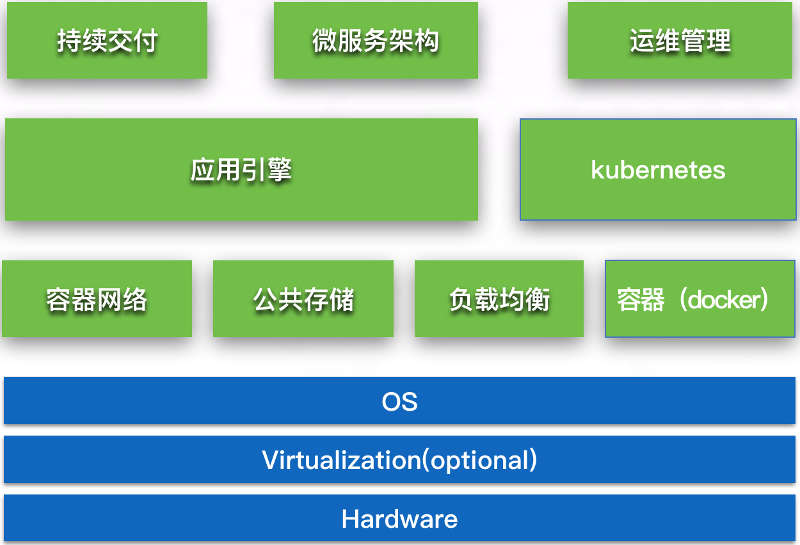
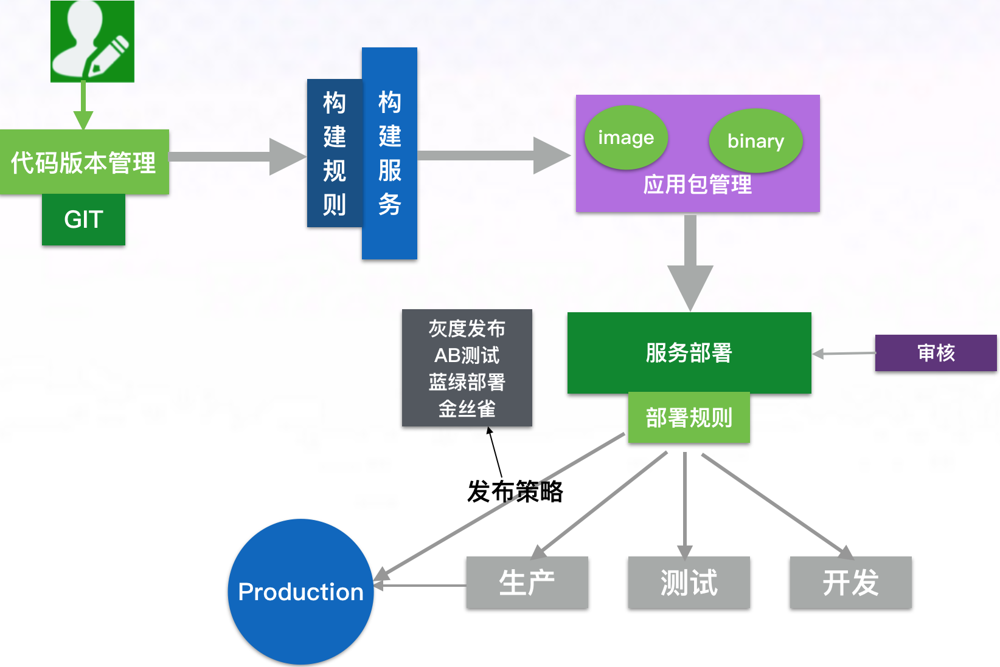

## 概览
通过springcloud的介绍和完整项目的演示，大家对它有全新的认识；下面我们重点去讲基于springcloud微服务架构如何在生产环境中是使用。
一个生产环境中的应用服务需要满足基本的特性：

1、部分软件、硬件、网络异常后应用能够可靠工作

2、多用户支持下应用继续工作

3、方便地添加和删除资源来适应不同的需求变化

4、方便部署、监控

## 生产环境搭建
   基于docker＋kubernate paas平台搭建，
   
   1、为什么采用这种架构？
   
   2、平台整体结构如下：
   
   

   
   3、模块介绍
   
       持续交付：
       
       微服务架构：
       
       运维管理：
       
       应用引擎：
       
       容器网络：
       
       公共存储：
       
       负载均衡：
       
       容器(docker):
       
       kubernetes:
   
## 应用的生命周期

## springcloud 应用结构图

## springcloud 服务发现机制

## springcloud 服务容错机制

## springcloud 服务编排

## springcloud 日志采集

## springcloud 监控体系

## springcloud 性能优化