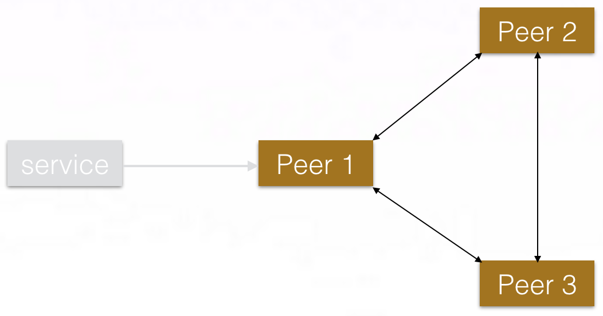

## 概览
通过springcloud的介绍和完整项目的演示，大家对它有全新的认识；下面我们重点去讲基于springcloud微服务架构如何在生产环境中是使用。
一个生产环境中的应用服务需要满足基本的特性：

1、部分软件、硬件、网络异常后应用能够可靠工作

2、多用户支持下应用继续工作

3、方便地添加和删除资源来适应不同的需求变化

4、方便部署、监控

## 生产环境搭建
   基于docker＋kubernate paas平台搭建，
   
   1、为什么采用这种架构？
   
   
   2、平台整体结构如下：
   
   

   
   3、模块介绍
   
       持续交付：
       
       微服务架构：
       
       运维管理：
       
       应用引擎：
       
       容器网络：
       
       公共存储：
       
       负载均衡：
       
       容器(docker):
       
       kubernetes:
   
## 应用的生命周期

## Piggymetrics应用结构图

## 配置中心高可用部署图

## 服务注册发现机制

1、采用eureka server进行服务注册发现管理

2、采用3个对等节点进行两两注册实现高可用，结构图

## springcloud 服务容错机制

1、采用hystrix进行熔断处理，通过hystrix dashboard图形化展示；如图

2、有默认的主动拉的方式变成的通过mq消息队列进行推模式，结构上更简单，效率上更实时

## k8s服务编排

1、什么是服务编排？

2、k8s如何进行服务编排？

3、服务编排详细信息(通过yaml文件描述)

## springcloud 日志采集

1、通过EFKA（elasticsearch fluentd kibana kafka）进行日志收集和展示

2、收集结构图

## springcloud 监控体系

1、通过实时的日志采集系统获取日志信息，利用时间窗口的技术利用进行日志分析

2、分析结构图

## springcloud 性能优化

1、注册中心配置优化

    eureka:
      instance:
        prefer-ip-address: true
      client:
        registerWithEureka: false
        fetchRegistry: false
        server:
          waitTimeInMsWhenSyncEmpty: 0
      server
        eviction-interval-timer-in-ms: 4000
        enableSelfPreservation: false
        renewalPercentThreshold: 0.9
        
2、zuul配置优化

    ribbon:
      ReadTimeout: 20000
      ConnectTimeout: 20000
      MaxAutoRetries: 1
      
    zuul:
      host:
        connect-timeout-millis: 20000
        socket-timeout-millis: 20000
        
3、Feign配置

    #请求和响应GZIP压缩支持
    feign.compression.request.enabled=true
    feign.compression.response.enabled=true
    #支持压缩的mime types
    feign.compression.request.enabled=true
    feign.compression.request.mime-types=text/xml,application/xml,application/json
    feign.compression.request.min-request-size=2048